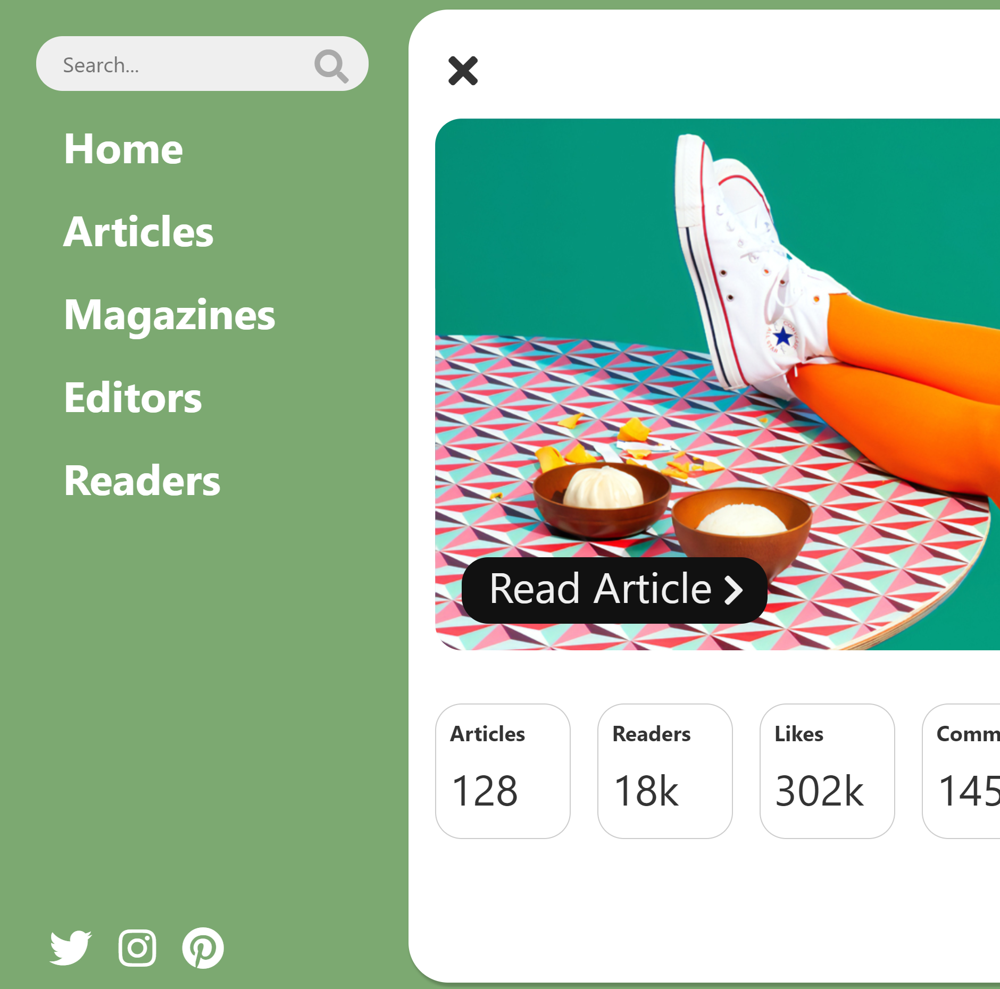
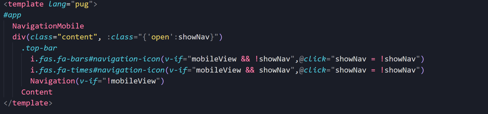

# pug-mobile-navigation


Screenshot


Code screenshot

## About

This project is an example of how to build a mobile navigation menu using Vue and Pug (template engine).
An event listener is added when the App.vue component is created to check if the mobile or desktop navigation should be displayed.
Vue will conditionally render the correct component as well as bind the "open" class to the content for the animation.

## Project setup

```
npm install
```

### Compiles and hot-reloads for development

```
npm run serve
```

### Compiles and minifies for production

```
npm run build
```

### Lints and fixes files

```
npm run lint
```

### Customize configuration

See [Configuration Reference](https://cli.vuejs.org/config/).
